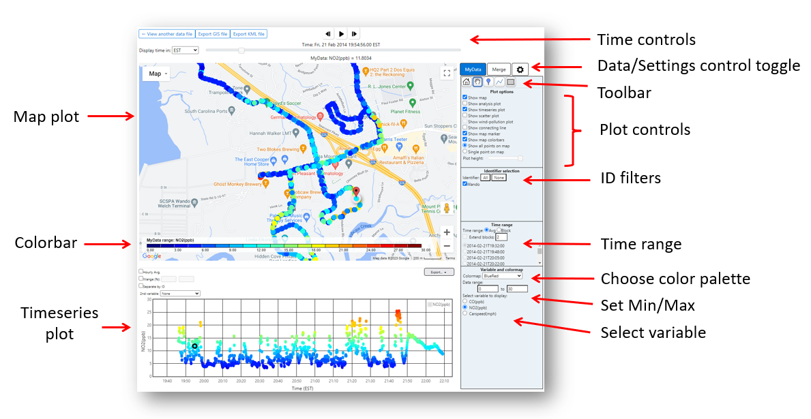
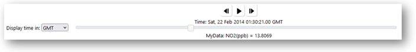

# RETIGO
REal TIme Geospatial Data Viewer (RETIGO) is a free, web-based tool that can be used to explore environmental data that you have collected either stationary or in motion (e.g., air quality sensors added to a bike).

- RETIGO allows you to add data from nearby air quality and meteorological stations.
    
- RETIGO can be used by anyone to explore data that they collected, but it does not move the data from the user’s computer, unless you decide to post your data to the RETIGO data repository.
    
- To collect the data, monitoring equipment is needed and ranges in price from ten dollar sensors, on up to professional grade equipment costing tens of thousands of dollars.

## Running RETIGO

Retigo is a client-side web application. It can be run directly by clicking https://usepa.github.io/retigo.

Alternatively you can download the code and run a standalone version directly on your computer using a temporary local http server. Popular options include using Python or Node.js to launch an http server. To use Python, open a terminal and navigate to the directory where retigo was installed. Then issue the command

_python3 -m http.server_

which will create a server on port 8000 by default. After that, point your web browser to http://localhost:8000/index.html to launch Retigo.

If you do not have Python installed, another way to create a temporary http server is to use Node.js, which can be installed from [https://nodejs.org/en/download](https://nodejs.org/en/download). Once node.js is installed, start the web server:

_npx http-server /path/to/retigo -o -p 9999_

Then run retigo by pointing your web browser to https://localhost:9999/path/to/retigo

## Using RETIGO

### Step 1: Prepare a data file
You can load a data file directly from RETIGO's data repository, or prepare a file using your own data. If you want to use the data repository, proceed to step 2.

RETIGO reads plain text data files, which can be either space or comma delimited. Here is an example of what a RETIGO data file should look like. Two complete example files can be downloaded below.

>\## Sampling day: July 18 2012  
\## Operator:     Jane Doe  
\## Location:     Raleigh NC  
\## Notes:        Weather is clear, light traffic  
Timestamp(UTC),EAST_LONGITUDE(deg),NORTH_LATITUDE(deg),ID(-),ozone(ppb),pm2.5(ug/m^3)  
2012-07-18T15:44:00-00:00,-78.9979,35.9508,route1,49.0491,32.6768  
2012-07-18T15:44:19-00:00,-78.9947,35.9470,route1,43.2706,26.7231  
2012-07-18T15:44:57-00:00,-78.9896,35.9361,route1,42.3130,34.1504    
2012-07-18T15:45:58-00:00,-78.9846,35.917,route1,47.7046,33.2918  
2012-07-18T15:46:17-00:00,-78.9733,35.9048,route1,47.7046,-9999   
[etc...]  

The first four lines in the example are comment lines (denoted by two hash symbols: ##). Comment lines can occur anywhere in the file, and can be used to make whatever annotations you wish. There is no limit to the number of comment lines allowed since they are completely ignored by the RETIGO program.

The next line is the header line, which identifies each column of data. The first four columns must be present in every file in the order listed in the example. They describe the time and position of each measurement, along with an identifier which can be used to sort the data when it is being analyzed. There should be at least one additional column that contains measurement data, and there can be up to ten such columns. The variable names should not include spaces. It is also suggested that units be included in the variable name. The exact format of each column is as follows:

**Column 1:**
Timestamp that conforms to the UTC/ISO 8601 international standard.

The timestamp should have the form **YYYY-MM-DDThh:mm:ssTZD**
*, where

  YYYY = four-digit year  
  MM   = two-digit month (01=January, etc.)  
  DD   = two-digit day of month (01 through 31)  
  hh   = two digits of hour (00 through 23) (am/pm NOT allowed)  
  mm   = two digits of minute (00 through 59)  
  ss   = two digits of second (00 through 59)  
  TZD  = time zone designator (+hh:mm or -hh:mm)  
  
For example, 2012-07-18T15:44:00-00:00 corresponds to July 18, 2012, 3:44:00pm Greenwich Mean Time (GMT).

The exact same instant of time could be represented in different US timezones as:
 
    2012-07-18T11:44:00-04:00 for Eastern Daylight Time  (EDT)
    2012-07-18T10:44:00-05:00 for Central Daylight Time  (CDT)
    2012-07-18T09:44:00-06:00 for Mountain Daylight Time (MDT)
    2012-07-18T08:44:00-07:00 for Pacific Daylight Time  (PDT)

    2012-07-18T10:44:00-05:00 for Eastern Standard Time  (EST)
    2012-07-18T09:44:00-06:00 for Central Standard Time  (CST)
    2012-07-18T08:44:00-07:00 for Mountain Standard Time (MST)
    2012-07-18T07:44:00-08:00 for Pacific Standard Time  (PST)

  \* Extra precision: For many users, the specification of time to the nearest second will be adequate. However, it is possible to add two decimal places of precision (hundredths of a second) by using a timestamp of the form **YYYY-MM-DDThh:mm:ss.ssTZD**

**Column 2:** East longitude in decimal degrees.

**Column 3:** North latitude in decimal degrees.

**Column 4:** Identifier string.

**Column 5+:** Measurement data, with data descriptor and units in the header.

At least one column of measurement data is required, but there can be additional data columns if desired. In the example above, two data columns are included ([ozone](https://www.epa.gov/ozone-layer-protection) and [pm2.5](https://www.epa.gov/particle-pollution-designations)). Use -9999 to indicate missing variable data.

To get started, you may want to download this sample file and proceed to the Step 2. You can also view a separate tutorial on how to create a RETIGO file from an Excel spreadsheet.

  Sample concentration data: MobileData_RETIGO.csv

This data is related to the recent publication *"On-road black carbon instrument intercomparison and aerosol characteristics by driving environment," A.L. Holder et al., Atmos. Environ., 88 (2014), pp. 183-191.*
[https://doi.org/10.1016/j.atmosenv.2014.01.021](https://doi.org/10.1016/j.atmosenv.2014.01.021).

**Wind data**  

Wind data can be included as separate vector components (magnitude and direction). In general, the wind data can have different temporal and spatial sampling than the pollution data. However, to create pollution rose plots, the wind data needs to be collected at the same time and location as the measurement data. The format of wind data is similar to that of the regular RETIGO data file outlined above. However, since wind is a vector quantity, both the magnitude and direction must be specified. For example:
```
Timestamp(UTC),EAST_LONGITUDE(deg),NORTH_LATITUDE(deg),ID(-),wind_magnitude(m/s),wind_direction(deg)  
2008-11-05T07:14:0005:00,-78.6140,35.8229,Sonic_anemometer,2.1729,0.0    
2008-11-05T07:14:05-05:00,-78.6140,35.8229,Sonic_anemometer,2.1998,45.0  
2008-11-05T07:14:10-05:00,-78.6140,35.8229,Sonic_anemometer,2.6970,90.0  
[etc...]
```
The units of the wind magnitude can be defined by the user (e.g. m/s, mi/hr), but the direction must be in degrees using the standard meteorological convention: the heading indicates the direction from which the wind originates (clockwise from North). A heading of 0 degrees indicates wind coming from the North, 90 degrees indicates wind from the East, etc.

RETIGO displays the wind in a vector sense, where the tip of the arrow points in the direction the wind is going. So a wind direction of 90 degrees specified in the file (from the East) would be pointing toward the West in the visualization.

### Step 2: Load Data or Select from Data Repository
Once you have a data file to view, go to the RETIGO application page and select a file to view from your local filesystem. If you have a second file pertaining to the same time period (e.g., from a second measurement system), you can include it as an optional second file. At this time, the application can only accept a maximum of two data files. If you do not have a file of your own to view, you can select a file from RETIGO's data repository. Once you have selected your options, click the View button to load the data and begin viewing it.

|  |
|:--:|
| *Figure 1: Uploading a file to the RETIGO repository* |

### Step 3: View the data
After you click the View button, your data will be loaded into the browser and displayed on both a map and a timeseries plot as shown in Figure 2. The colors indicate the value of the selected variable, ranging from dark blue (low) to red (high) by default. RETIGO automatically determines the lowest and highest values of the selected variable and adjusts the color scale accordingly. You can also customize the colorbar by setting the minimum and maximum values for each variable.

|  |
|:--:|
| *Figure 2: Uploaded RETIGO data displayed on a map and a timeseries plot, with display settings highlighted* |

**Data Control Toggle**

The Data/Settings control toggle allows you to change menus to perform different tasks. The following is a brief overview of the menu selections. The options that you can select in each menu will be discussed in greater detail later in this tutorial. 

- “MyData” (Figure 3) is for choosing options pertaining to the data file that you loaded in Step 2.
  - When the Data Control Toggle is set to "MyData", you are presented with controls that allow you to choose how to display your data. You may choose to view several types of plots, including the map and timeseries that are shown by default, by selecting or de-selecting the box next to each option.

  - Other available options allow you to view the data as a function of distance from a selected point or polyline, a scatterplot, and/or a wind-pollution plot.

  - In addition, you can choose which variable to display, select the data range and colormap (palette), and choose between a time averaged overview of your data or short segments of full time resolved data.

- “Merge” (Figure 3) is for bringing in supporting web-accessible data that was collected independently of your data.

  - When the Data Control Toggle is set to "Merge", the menu options change to allow you to bring in relevant air quality data from various sources including the AirNow network, PurpleAir, the World Meteorological Organization Global Surface Meteorology Monitoring Network, and various satellite data products.
  - To access PurpleAir data, you must supply an API read key, which you can request for free from PurpleAir, Inc.
  - You can also load your own stationary monitoring data from a file (up to 5).
  - If you choose to show web-available monitoring data such as AirNow, RETIGO will automatically retrieve the data if it is available and display it alongside your measurements. The data retrieval may take a minute or two depending upon the time and spatial extent of your dataset.
- “Settings" (gear icon) (Figure 4) is for selecting certain options for how plots are presented.
  - When the Data Control Toggle is set to "Settings", the menu options allow you to choose the font size for the control panel and plot options for the various supporting plot types (timeseries, scatterplot, etc.).
  
|  |
|:--:|
| *Figure 3: RETIGO's MyData and Merge menu options* |

|  |
|:--:|
| *Figure 4: RETIGO's Settings menu (gear icon)* |

**Select variable**

All the measured variable names (in column 5 and beyond in the data file) are shown in the "select variable" area. Simply click the radio button next to the variable that you would like to see. RETIGO will automatically show the data on the map and update the colorbar accordingly. You can also select which colormap to use and adjust the range of the variable by entering minimum and maximum values into the appropriate text boxes. The data range will apply to the map and to all supporting plots (timeseries, etc.). 

**Time control**

The time control is a horizontal slider (Figure 5) near the top of the application that is used to pinpoint a particular data sample in time. The selected time is shown above the slider, referenced to the desired timezone. The corresponding data value is shown below the slider. Dragging the slider allows you to track the dataset over time. You can also use the animation controls to animate or single-step through time.

|  |
|:--:|
| *Figure 5: RETIGO time control slider with associated timestamp* |

**Toolbar**

|  |
|:--:|
| *Figure 6: RETIGO toolbar* |

The toolbar (Figure 6) allows you to interact with the map in various ways:

- The "home" button automatically centers the map around your data, and sets the optimal zoom level to show the entire dataset.
- The "move map" button lets you recenter the map. With the "move map" icon selected, simply left-click anywhere in the map and drag the mouse while keeping the left mouse button down. Once the map is in the desired position, let go of the mouse button.
- The "drop analysis point" function lets you designate a point on the map, denoted by a pushpin. You can then plot your data as a function of distance from the point (see below). This might be useful if you know the location of a pollutant source. To designate a point, select the icon and then left-click anywhere on the map. A pushpin will appear to mark the selected point. The pushpin can be dragged to a new location by simply left-clicking on it, moving it to a new location, and letting go of the mouse button. To delete the pushpin, right click on it.
- The "create analysis polyline" function is similar to the analysis point, except you create a polyline instead of a point. Left-click to create the starting point, and then again to create the ending point. The polyline can be modified into any shape by clicking on the center of the line and displacing it, creating two new line segments each with a new center. By repeatedly adjusting the location of the centers, the polyline can take on any shape. For example, the polyline could be made to approximate the contour of a road. To delete the polyline, right click on it.
- The "crop region" function lets you exclude all data outside of the defined box. With the crop region icon selected, simply left click and drag on the map to define the region of interest. Any analysis plots that are active (see below) will automatically update to reflect the selection. To delete the crop region, right click on it.

### Step 4: Investigate the data

RETIGO provides a few simple ways to investigate your data:

- Plot data as a function of time
- Plot data vs. distance from a point
- Plot data vs. minimum distance from a polyline
- Plot data in a polar wind-pollution format
- Plot one variable versus another in a scatterplot

You can turn the supporting plots on and off using the checkboxes underneath the toolbar. It is possible to have any combination of the map, timeseries plot, analysis plot, wind-pollution plot, and scatterplot active at once.

**Timeseries plot**

The timeseries plot (Figure 7) shows the selected variable as a function of time. As you move the time control slider, the corresponding datapoint is highlighted in the timeseries plot with a black circle. You can also add a second variable to the plot, which will be shown with a black triangle and will correspond to a new y-axis on the right. You can zoom into a smaller portion of the time series by using your mouse to click and drag around the area of interest in the horizontal direction. Checking the “hourly average” option may be handy for comparing your data to AirNow and other monitoring data that are on an hourly timebase.

|  |
|:--:|
| *Figure 7: RETIGO timeseries plot* |

**Analysis plot**

The analysis plot (Figure 8) shows the selected variable as a function of distance from the designated analysis point or polyline. See the “Toolbar” controls section above to learn how to designate these. As you move the time control slider, the corresponding datapoint is highlighted in the analysis plot with a black circle (marker) or triangle (polyline). 

|  |
|:--:|
| *Figure 8: RETIGO analysis plot* |

You can also choose to aggregate the data into bins of a designated size; the mean and standard deviation are automatically computed and displayed (Figure 9).

|  |
|:--:|
| *Figure 9: RETIGO analysis plot with data aggregated into bins* |

**Scatterplot**

The scatterplot is used for plotting one source of data versus another (Figure 10). This can be useful for investigating correlations between differing data variables or for comparing like variables separated in space. You can choose any of the variables from your dataset, as well as any merged variables. Simply choose which variable to plot on the X and Y axes. All data are automatically aggregated to the hour to ensure that each point on the scatterplot is equally represented in time with respect to the selected X/Y variables. Summary statistics are automatically computed, including the correlation coefficient, the y-intercept and slope of the regression line, and the root-mean-square (rms) error. 

|  |
|:--:|
| *Figure 10: Plotting one source of data versus another* |

**Wind pollution plot**

If wind vector data is present in your data, you can view a wind-pollution plot for the selected variable (Figure 11). This is a polar plot, where the angle is equal to the wind heading, the distance from the center is equal to the wind magnitude, and the color corresponds to the value of the selected variable. For example, the marker located within the square on the image below represents a measurement that occurred when the wind was from the southeast, with an approximate wind speed of 4 m/s, and the color can be matched to the colorbar representing the pollution concentration range, in this case about 50 ppb. The wind-pollution plot is best suited for stationary data.

|  |
|:--:|
| *Figure 11: RETIGO wind-pollution plot* |

**Show connecting line**

This option connects your data with a red line to better visualize the path that was taken during the data collection. It is useful if you are viewing data in "single point" mode (Figure 12).

|  |
|:--:|
| *Figure 12: RETIGO show connecting line option* |

**Crop region**

Use the crop region function to exclude data outside of a region of interest (Figure 13). After clicking on the crop region icon, simply left click and drag on the map to define the region. When the mouse button is released the map and analysis plots will automatically be updated. The crop box can be deleted by right-clicking anywhere inside it.

|  |
|:--:|
| *Figure 13: RETIGO crop region function* |

**Using IDs**

The RETIGO file specification allows you to tag each data point with an identifier (ID), which is composed of alphanumeric characters. You can use the IDs to group your data in any way you like, and isolate them in the visualization (Figure 14).

|  |
|:--:|
| *Figure 14: Isolating data points tagged with identifiers* |

**Time mode / Large file support**

For efficiency, RETIGO only shows 1,000 points at a time. If your dataset contains more points, say 100,000, you can look at the dataset in one of two ways (Figure 15).

- Using average mode (default), the data is time averaged into bins, such that there will be approximately 1,000 bins. In this example, every 100 points would be time-averaged, yielding 1,000 points to be shown on the map.
- If you want to see your un-averaged data, select block mode. Here, the data can be accessed 1,000 points at a time in blocks. The starting time of each block is listed in the menu. You can click through the list of blocks one by one to view the entire dataset. There is no limit to the number of data points that your dataset may have; larger files will simply have more blocks. If you are using the timeseries plot, you can extend the range by clicking "Extend blocks" and selecting the number of additional blocks to view (up to five).

|  |
|:--:|
| *Figure 15: Viewing time-averaged data (left) and non-averaged data (right)* |

**Other features**

The map display is a fully functioning Google Map™ display (Figure 16).

|  |
|:--:|
| *Figure 16: Google Maps functionality available* |

The map selector lets you switch between a regular roadmap, a terrain map, or a satellite view. The zoom control allows you to zoom in or out using the slider or the plus and minus buttons at the top and bottom of the slider. Sometimes the terrain view limits the zoom level, so you may need to choose a different map if you want to zoom all the way in.

To use Google Street View™, left-click on the Street View icon and drag it to your location of interest on the map. Everywhere that Street View is available will be highlighted in blue. When you let go of the mouse, the RETIGO view will automatically change to Street View (Figure 17). The view can be rotated and navigated using the mouse. To return to the main map, click the "x" in the upper right hand corner.

**Note**: The satellite map and Street View images are collected at different times (sometimes months or years apart), but both are updated periodically by Google, Inc. Both may not reflect the exact conditions present at the time of your data collection, so care must be taken when interpreting the imagery.

|  |
|:--:|
| *Figure 17: RETIGO data is viewable via Google Maps' Street View* |

### Step 5: Merging in other data

Click on the Merge tab to add data to either the map or timeseries plot. You can add data from ground based in-situ point sources such as AirNow, PurpleAir, and weather monitors. In addition, you can add satellite-derived data sources pertaining to smoke and aerosols throughout the air column.

**Point sources**

You can add various point data to the map or timeseries, including AirNow monitoring sites (shown as circles), PurpleAir sensors (shown as squares), and weather monitoring (METAR) sites (shown as custom glyphs). When you select each data source, RETIGO will automatically pull in data for the same location and time period as your data, if it is available. You may have to zoom out the map in order to see the additional sites on the map. To access PurpleAir data, you must first obtain an API read key from PurpleAir, Inc. and enter it in the appropriate box on the Merge tab. 

When AirNow, PurpleAir, or METAR data are added to the timeseries plot, the added data uses a separate y-axis and data range (Figure 18). When comparing to your data, be sure to adjust the data ranges accordingly. 
 
 |  |
 |:--:|
 | *Figure 18: AirNow and PurpleAir data sites mapped in RETIGO* |
 
 If you are plotting AirNow, PurpleAir, or METAR data on the timeseries, its corresponding site on the map will have a halo around it (Figure 19). You can select a different site by clicking the site’s icon on the map. In addition, you can hover the mouse over any map icon to see its data value corresponding to the selected time.
 
 |  |
 |:--:|
 | *Figure 19: A PurpleAir site marked by a "halo"* |
 
 **Satellite derived data**
 
 You can add satellite-derived data only to the map. The available sources include:

- Fire detections from the Hazard Mapping System (HMS), shown as fire icons (Figure 20).
- True color imagery from NASA’s Visible Infrared Imaging Radiometer suite (VIIRS) (Figure 21).
- VIIRS aerosol optical depth (AOD). Higher values indicate more aerosols in the integrated vertical air column (Figure 22).
- Column integrated nitrogen dioxide (NO2) from the European Space Agency’s TROPOspheric Monitoring Instrument (TROPOMI) (Figure 23).   

Following are examples of satellite data products added to the map (via the Merge tab) that help characterize the location of a wildfire and the downwind transport of the associated smoke plume.

|  |
|:--:|
| *Figure 20: Cluster of fire icons on RETIGO map signifying satellite-based fire detections* |

|  |
|:--:|
| *Figure 21: VIIRS true-color imagery showing smoke plume from detected fires* |

|  |
|:--:|
| *Figure 22: VIIRS AOD data shows more aerosols in the air columns as the plume extends* |

|  |
|:--:|
| *Figure 23: TROPOMI data showing the density of nitrogen dioxide in the atmosphere as an impact from the plume* |
